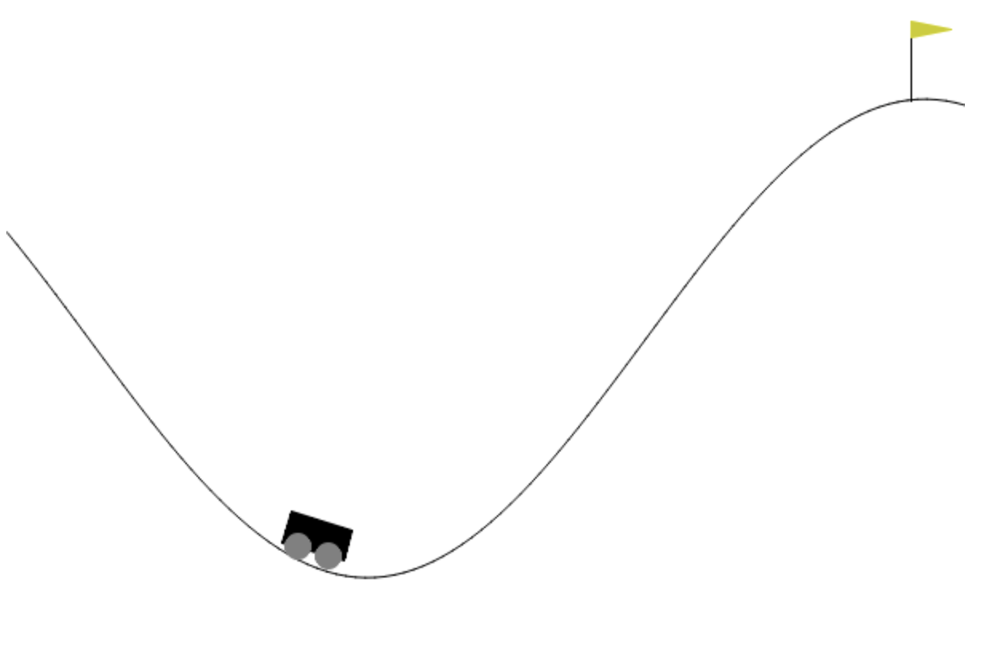

# Solving the Mountain Car Problem with Value Iteration

In this exercise, we'll solve the Mountain Car problem using Value Iteration in the Gymnasium environment. The action space is discrete, and the state space is continuous. The objective is to find an optimal policy that drives the car to reach the flag at the top of the hill. Although there is a version with a continuous action space, we'll focus on the discrete version.

{width=50%}

To achieve this, we will first represent the mountain car environment as a Markov Decision Process (MDP) and then use the Value Iteration algorithm to compute the optimal policy.

## Defining the MDP

The Mountain Car problem can be modeled as an MDP with the following characteristics:

- **State Space**: Consists of the car's position and velocity:
  - Position: A continuous value in the range $[-1.2, 0.6]$.
  - Velocity: A continuous value in the range $[-0.07, 0.07]$.

- **Action Space**: The agent can choose from three actions:
  - `0`: Push left
  - `1`: No push
  - `2`: Push right

- **Reward**: 
  - The reward is $-1$ for all transitions, except when the terminal state is reached (position > 0.5), where the reward is 0.

- **Transition Dynamics**:
  - Velocity update: 
    $$
    \text{new\_velocity} = \text{velocity} + 0.001 \times (\text{action} - 1) - 0.0025 \times \cos(3 \times \text{position})
    $$
  - Position update:
    $$
    \text{new\_position} = \text{position} + \text{velocity}
    $$

## Objective

### Step 1: Define the MDP Class

1. **Discretization**: 
   - Convert the continuous state space (position and velocity) into a finite set of discrete states. To do this, you can implement the following functions:
     - `discretize_position(position, n)`: Discretizes the position into `n` bins.
     - `discretize_velocity(velocity, n)`: Discretizes the velocity into `n` bins.
     - `discretize(position, velocity, discretization)`: Combines the discretized position and velocity into a single state.
   - Implement a function to map discrete states back to continuous space:
     - `map_state_to_continuous(state, discretization)`: Maps a discrete state to a continuous state by sampling uniformly from the corresponding bin.

**Example:**

For $n = 3$, the range $[-1, 1]$ is divided into three bins:

- Bin 0: $[-1, -0.5]$
- Bin 1: $[-0.5, 0]$
- Bin 2: $[0, 1]$

A value of $-0.25$ falls into bin 1 (second bin) hence $-0.25$ is mapped to $1$.

2. **Action Space**: 
   - Define the actions as `0` (push left), `1` (no push), and `2` (push right).

### Step 2: Compute Transition Probabilities and Rewards

- **Transition Probabilities**: 
  - For each state-action pair in the discrete space, sample 30 points in the continuous space, compute the next state, and map it to the discrete space. Normalize these counts to compute the transition probabilities.

- **Rewards**: 
  - Calculate the rewards for all state-action-next state transitions.
  - Hint: The reward is $-1$ for all transitions except for the terminal state, where it is $0$.

### Step 3: Implement Value Iteration and Extract the Policy

1. **Value Iteration Algorithm**:
   - Use the Bellman optimality equation to iteratively update the value function until convergence or a set number of iterations.

2. **Policy Extraction**:
   - Derive the optimal policy by selecting the action that maximizes the expected return for each state based on the computed value function.
   - You can save your policy in a file using `pickle`, for example in file `policy.pkl`.

### Step 4: Test the Policy on the Mountain Car Environment

Run the computed policy on the Mountain Car environment to validate its performance.

**Good luck!**
